# Jarkom_Modul3_Lapres_C01
Praktikum Modul 3 Jaringan Komputer 2020

## NAMA ANGGOTA KELOMPOK :

**1. Devi Hainun Pasya (05111840000014)**

**2. Kevin Christian Hadinata (05111840000066)**

## PEMBAHASAN SOAL

### **Nomor 1**
Membuat topologi jaringan demi kelancaran TA-nya dengan kriteria sebagai berikut :

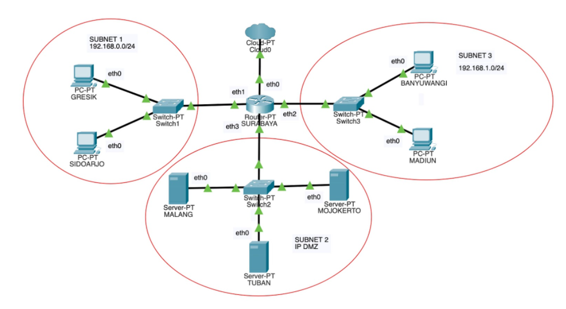

Bu Meguri memerintahkan Anri untuk menjadikan SURABAYA sebagai router, MALANG sebagai DNS Server, TUBAN sebagai DHCP server, serta MOJOKERTO sebagai Proxy server, dan UML lainnya sebagai client. 

Tambahkan konfigurasi untuk pembuatan switch, router dan client pada file `topologi.sh`, sebagai berikut :
```
# Switch
uml_switch -unix switch1 > /dev/null < /dev/null &
uml_switch -unix switch2 > /dev/null < /dev/null &
uml_switch -unix switch3 > /dev/null < /dev/null &

# Router
xterm -T SURABAYA -e linux ubd0=SURABAYA,jarkom umid=SURABAYA eth0=tuntap,,,10.151.76.9 eth1=daemon,,,switch1 eth2=daemon,,,switch3 eth3=daemon,,,switch2 mem=256M &

# Server
xterm -T MALANG -e linux ubd0=MALANG,jarkom umid=MALANG eth0=daemon,,,switch2 mem=160M &
xterm -T MOJOKERTO -e linux ubd0=MOJOKERTO,jarkom umid=MOJOKERTO eth0=daemon,,,switch2 mem=128M &
xterm -T TUBAN -e linux ubd0=TUBAN,jarkom umid=TUBAN eth0=daemon,,,switch2 mem=128M &

# Klien
xterm -T SIDOARJO -e linux ubd0=SIDOARJO,jarkom umid=SIDOARJO eth0=daemon,,,switch1 mem=64M &
xterm -T GRESIK -e linux ubd0=GRESIK,jarkom umid=GRESIK eth0=daemon,,,switch1 mem=64M &
xterm -T MADIUN -e linux ubd0=MADIUN,jarkom umid=MADIUN eth0=daemon,,,switch3 mem=64M &
xterm -T BANYUWANGI -e linux ubd0=BANYUWANGI,jarkom umid=BANYUWANGI eth0=daemon,,,switch3 mem=64M &
```

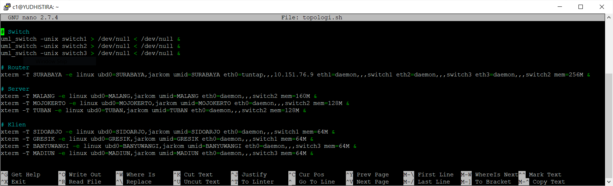

Setelah login, setting IP pada setiap UML dengan mengetikkan `nano /etc/network/interfaces`. Lalu ditambahkan settingan sebagai berikut :

Pada UML SURABAYA (Router) :
```
auto lo
iface lo inet loopback

auto eth0
iface eth0 inet static
address 10.151.76.10
netmask 255.255.255.252
gateway 10.151.76.9
		
auto eth1
iface eth1 inet static
address 192.168.0.1
netmask 255.255.255.0

auto eth2
iface eth2 inet static
address 192.168.1.1
netmask 255.255.255.0

auto eth3
iface eth2 inet static
address 10.151.77.17
netmask 255.255.255.248
```

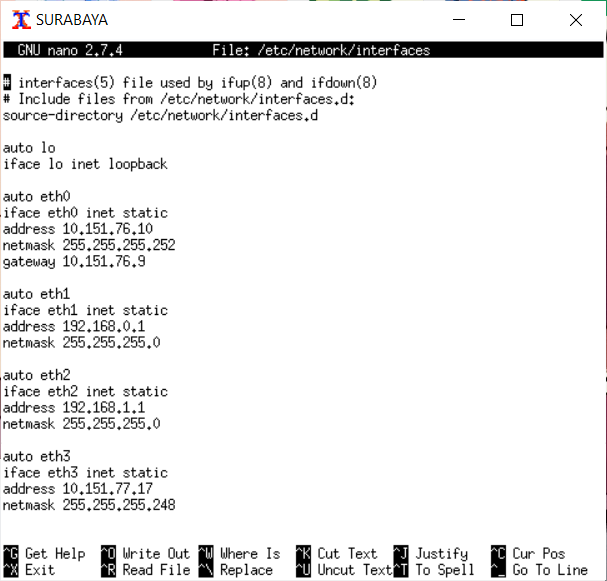

Pada UML MALANG (DNS Server) :
```
auto lo
iface lo inet loopback

auto eth0
iface eth0 inet static
address 10.151.77.18
netmask 255.255.255.248
gateway 10.151.77.17
```

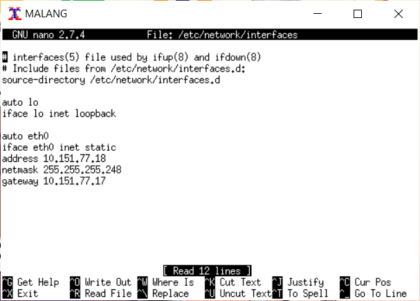

Pada UML MOJOKERTO (Proxy Server) :
```
auto lo
iface lo inet loopback

auto eth0
iface eth0 inet static
address 10.151.77.19
netmask 255.255.255.248
gateway 10.151.77.17	
```

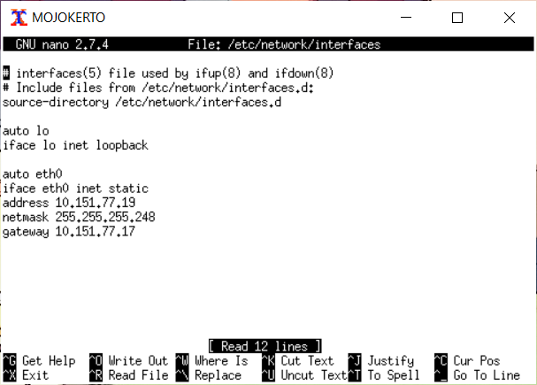

Pada UML TUBAN (DHCP Server) :
```
auto lo
iface lo inet loopback

auto eth0
iface eth0 inet static
address 10.151.77.20
netmask 255.255.255.248
gateway 10.151.77.17
```

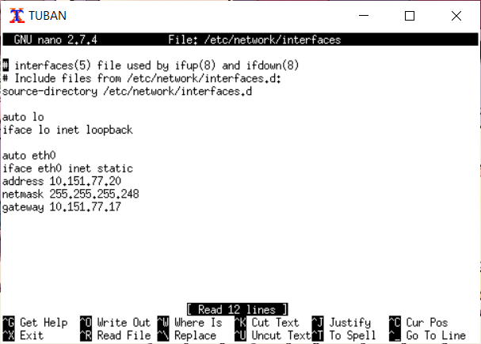

Karena konfigurasi Client tidak diperbolehkan menggunakan IP statis, maka konfigurasinya adalah sebagai berikut. Pada UML 
GRESIK, SIDOARJO, BANYUWANGI, MADIUN (Client) :
```
auto lo
iface lo inet loopback

auto eth0
iface eth0 inet dhcp
```

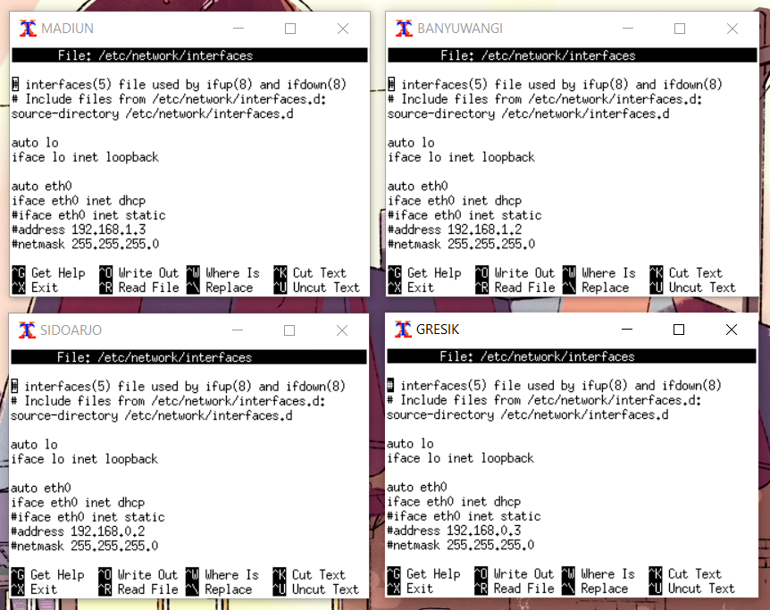

Kemudian restart semua UML dengan mengetikkan `service networking restart`. 

### **Nomor 2**
SURABAYA ditunjuk sebagai perantara (DHCP Relay) antara DHCP Server dan client.

Karena SURABAYA yang ditunjuk, maka install dhcp-relay pada SURABYA dengan command :
```
apt-get install isc-dhcp-relay
```

Kemudian kita atur konfigurasi interfacenya agar mengarah ke TUBAN. Pertama buka file konfigurasi dhcp-relay dengan command :
```
nano /etc/default/isc-dhcp-relay
```
agar mengarah ke TUBAN ditambahkan :
```
SERVERS="10.151.77.20" 
INTERFACESv4="eth1 eth2 eth3"
```

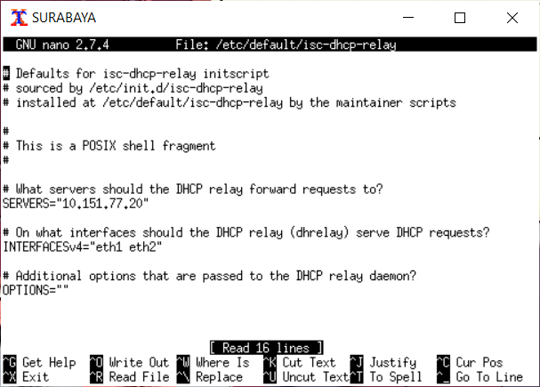

kemudian restart dengan command `service-isc-dhcp-relay restart`

### **Nomor 3**
Client pada subnet 1 mendapatkan range IP dari 192.168.0.10 sampai 192.168.0.100 dan 192.168.0.110 sampai 192.168.0.200.

Sebelum melakukan instalasi dhcp server, terlebih dahulu melakukan `apt-get update` setelah itu menginstall dengan menggunakan command `apt-get install isc-dhcp-server`.

Setelah itu, konfigurasi dhcp server dimulai. Karena TUBAN yang dijadikan sebagai DHCP server, maka konfigurasi interface dilakukan di TUBAN. Buka konfigurasi file interface dengan perintah :
```
nano /etc/default/isc-dhcp-server
```

Kemudian berikan layanan DHCP kepada `eth0` dengan menambahkan `INTERFACES="eth0"`.

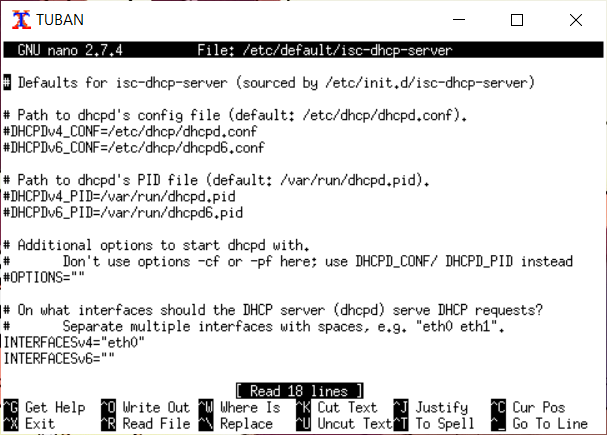

Kemudian untuk mengatur range IP masing-masing subnet, buka file konfigurasi DHCP dengan perintah :
```
nano /etc/dhcp/dhcpd.conf
```

Kemudian tambahkan script berikut untuk subnet 1 :
```
range 192.168.0.10 192.168.0.100;
range 192.168.0.110 192.168.0.200;
```

### **Nomor 4**
Client pada subnet 3 mendapatkan range IP dari 192.168.1.50 sampai 192.168.1.70.

Untuk mengatur range IP masing-masing subnet, buka file konfigurasi DHCP dengan perintah :
```
nano /etc/dhcp/dhcpd.conf
```

Kemudian tambahkan script berikut untuk subnet 2 :
```
range 192.168.1.50 192.168.1.70;
```

### **Nomor 5**
Client mendapatkan DNS Malang dan DNS 202.46.129.2 dari DHCP.

Untuk mengatur DNS yang didapat masing-masing subnet, buka file konfigurasi DHCP dengan perintah :
```
nano /etc/dhcp/dhcpd.conf
```

IP MALANG kelompok kami adalah `10.151.77.18`. Maka ditambahkan script berikut pada subnet 1 dan subnet 2 :
```
option domain-name-servers 10.151.77.18, 202.46.129.2;
```

Hasil : 

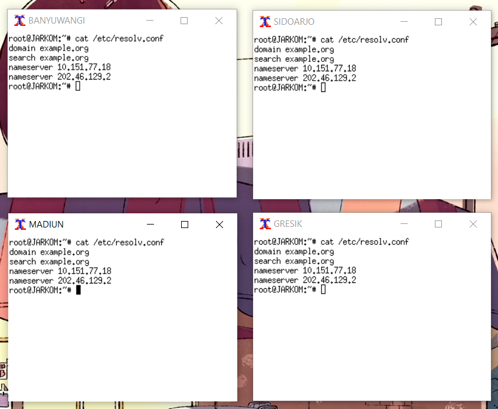

### **Nomor 6**
Client di subnet 1 mendapatkan peminjaman alamat IP selama 5 menit, sedangkan client pada subnet 3 mendapatkan peminjaman IP selama 10 menit.

Untuk mengatur waktu peminjaman alamat IP yang didapat masing-masing subnet, buka file konfigurasi DHCP dengan perintah :
```
nano /etc/dhcp/dhcpd.conf
```

Subnet 1 diberikan waktu peminjaman selama 5 menit = 300 detik. Maka ditambahkan script berikut pada subnet 1 :
```
default-lease-time 300;
max-lease-time 7200;
```
Subnet 2 diberikan waktu peminjaman selama 10 menit = 600 detik. Maka ditambahkan script berikut pada subnet 2 :
```
default-lease-time 600;
max-lease-time 7200;
```

Berikut adalah konfigurasi dari nomor 3 - 6 :

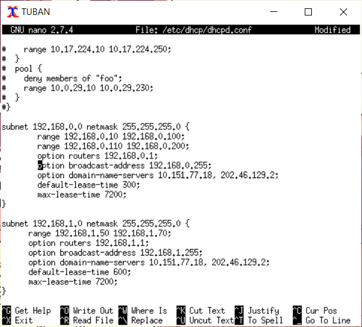

Setelah semua konfigurasi terpasang, restart service isc-dhcp-server dengan perintah :
```
service isc-dhcp-server restart
```

### **Nomor 7**
Setelah melakukan pengaturan pada *proxy server* (Mojokerto), kita dapat melakukan fungsi ```htpasswd``` yang didapat melalui ```apache2-utils```.

Untuk kasus nomor 7 dan kelompok C01,
kami mengetikkan
```
htpasswd -c /etc/squid/passwd userta_c01
```
Setelah itu akan muncul tempat untuk melakukan *input password* dan kami isikan
```
inipassw0rdta_c01
```

Setelah itu, kami melakukan konfigurasi pada ```/etc/squid/squid.conf/``` dan mengetikkan
```
auth_param basic program /usr/lib/squid/basic_ncsa_auth /etc/squid/passwd
auth_param basic children 5
auth_param basic realm Proxy
auth_param basic credentialsttl 2 hours
auth_param basic casesensitive on
acl USERS proxy_auth REQUIRED
http_access allow USERS
```

Setelah itu, lakukan restart pada squid dengan ```service squid restart``` maka halaman yang diakses menggunakan *proxy* akan membutuhkan *username* dan *password* untuk dapat diakses.

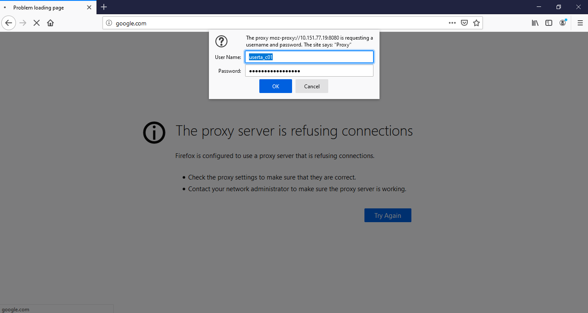

### **Nomor 8**
Dengan menggunakan ***Access Control Lists*** atau biasa disingkat ***ACL***, kita dapat mengatur waktu kapan *proxy* kita dapat mengakses suatu situs.

Pertama, buat konfigurasi di  ```/etc/squid/acl.conf```, lalu masukkan perintah yang diinginkan. *Syntax* yang digunakan antara lain:
```
acl {nama_acl) time {inisial hari} {jam dalam format 24H}
```
Sehingga, apabila kita mau membiarkan *proxy* dapat mengakses situs setiap hari ```Selasa-Rabu pukul 13.00-18.00```, kita dapat menuliskan:
```
acl AVAILABLE_WORKING time TW 13.00-18.00
```
**T** menandakan *Tuesday* dan **W** menandakan *Wednesday*.

Setelah itu, kita perlu melakukan konfigurasi kembali pada ```squid.conf``` dengan menambahkan
```
include /etc/squid/acl.conf

http_access allow AVAILABLE_WORKING
http_access deny all
```
Jangan lupa untuk melakukan ```service squid restart``` setelah selesai melakukan konfigurasi.

### **Nomor 9**
Karena *time* pada ACL berlaku format **h1:m1-h2:m2** dengan syarat ```h1<h2 dan m1<m2```, kita perlu memisahkan jam yang diperbolehkan untuk kasus nomor 9. Caranya dengan menambahkan:
```
acl BIMBINGAN time TWH 21:00-23:59
acl BIMBINGAN1 time WHF 00:00-09.00
```
pada ```acl.conf```. Setelah itu, kita tinggal menambahkan ***BIMBINGAN*** dan ***BIMBINGAN1*** pada ```squid.conf``` dengan menuliskan:
```
http_access allow AVAILABLE_WORKING BIMBINGAN BIMBINGAN1
```
Setelah itu, lakukan restart pada *squid*.

### **Nomor 10**
Untuk melakukan *redirect*, kita menggunakan fitur lain yang dimiliki oleh *squid*, yaitu **url_regex**.

Edit file ```/etc/squid/acl.conf``` dengan menambahkan:
```
acl redirect url_regex google.com
```
Setelah itu, kita tinggal menambahkan situs yang ingin kita tuju pada ```/etc/squid/squid.conf``` dengan cara:
```
http_access deny redirect
deny_info http://monta.if.its.ac.id/ redirect
```
Setelah itu lakukan restart pada *squid*.

### **Nomor 11**
Setelah melakukan ```wget 10.151.36.202/ERR_ACCESS_DENIED```, kita tinggal membuat direktori pada folder squid dengan cara
```
mkdir /etc/squid/pages/
```
lalu *copy file* yang barusan kita copy ke dalam folder tersebut:
```
cp -r ERR_ACCESS_DENIED /etc/squid/pages/
```

Setelah itu, kita tinggal menambahkan *folder* tersebut pada ```squid.conf``` dengan mengetikkan:
```
error_directory /etc/squid/pages
```
Setelah itu, lakukan restart *squid*.

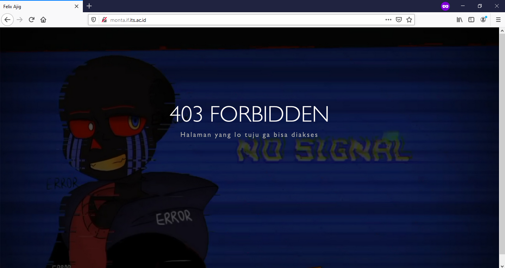

### **Nomor 12**
Untuk membuat domain ***janganlupa-ta.c01.pw***, kita menggunakan langkah-langkah seperti dari modul sebelumnya, yaitu ```Domain Name Server```.

Buka dan *install* ```bind9``` pada UML ***Malang***. Setelah itu, pada ```/etc/bind/named.conf.local```, isikan:
```
zone "janganlupa-ta.c01.pw" {
	type master;
	file "/etc/bind/ta/janganlupa-ta.c01.pw";
};
```
Setelah itu, lakukan *copy* ```db.local``` dengan cara
```
cp /etc/bind/db.local /etc/bind/ta/janganlupa-ta.c01.pw
```
Langkah berikutnya, *edit file* tersebut dengan mengganti ```localhost``` menjadi ```janganlupa-ta.c01.pw``` dan memasukkan IP Mojokerto pada bagian
```
@       IN      A   10.151.77.19    ;IP MOJOKERTO
```
setelah itu lakukan *restart* pada ```bind9``` dan lakukan konfigurasi pada *proxy server* pada ***web browser*** dengan memasukkan ```janganlupa-ta.c01.pw```.

## Referensi
* https://github.com/arsitektur-jaringan-komputer/Modul-Jarkom/tree/modul-3/Proxy%20Server
* https://github.com/arsitektur-jaringan-komputer/Modul-Jarkom/tree/modul-2/DNS
* https://github.com/arsitektur-jaringan-komputer/Modul-Jarkom/tree/modul-3/DHCP
* https://github.com/arsitektur-jaringan-komputer/Modul-Jarkom/blob/modul-uml/README.md
